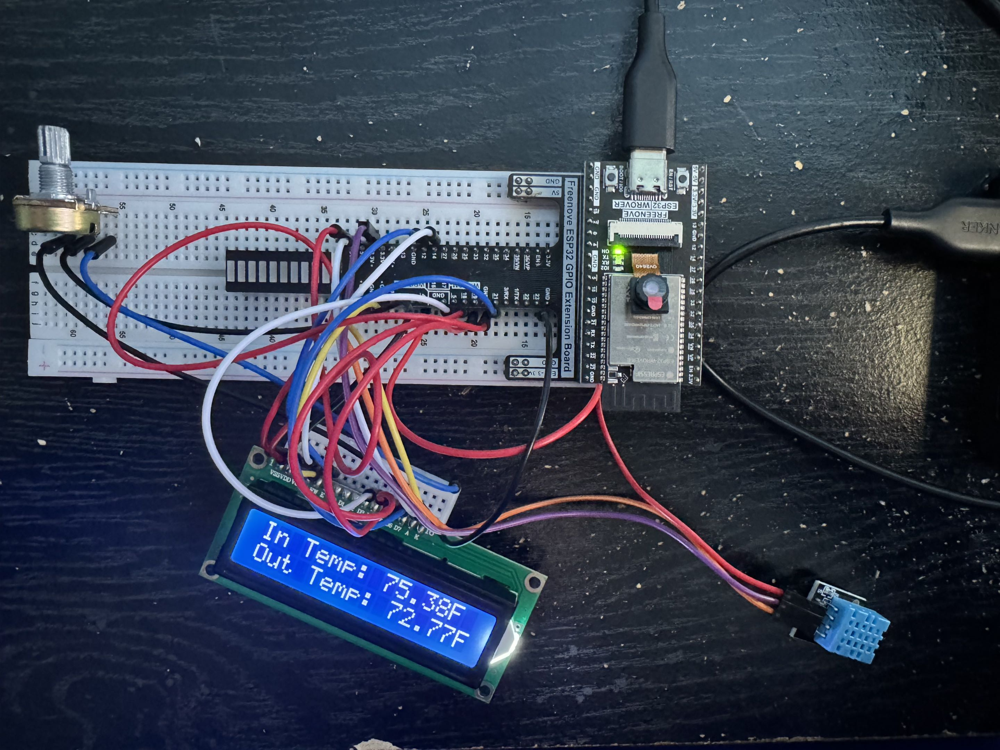

# ESP32 IoT Weather Station

An ESP32-based weather station that combines **indoor temperature and humidity readings** with **outdoor weather data from OpenWeatherMap** and displays the information on a **16×2 character LCD**.

I built this project to practice embedded C++, sensor integration, LCD interfacing, Wi-Fi connectivity, HTTP requests, JSON parsing, and hardware/firmware debugging.

## Features

- Reads indoor temperature and humidity using a DHT11 sensor.
- Requests outdoor weather information from OpenWeatherMap over Wi-Fi.
- Parses the API's JSON response for display on an LCD1602.
- Interfaces directly with a **non-I²C LCD1602 in 4-bit parallel mode**.
- Requests outdoor weather data in imperial units.

## Hardware

| Component | Role |
| --- | --- |
| ESP32 development board (ESP32-WROVER-E) | Reads the sensor, communicates over Wi-Fi, and controls the display |
| DHT11 temperature/humidity sensor | Measures indoor conditions |
| LCD1602 (16×2, parallel interface) | Displays weather information |
| Potentiometer | Adjusts LCD contrast |
| Breadboard and jumper wires | Connects the prototype |
| USB cable and power source | Powers and programs the ESP32 |

## Software

- **Language:** C++ using the Arduino framework
- **Development environment:** Arduino IDE
- **Libraries:** `WiFi.h`, `HTTPClient.h`, `ArduinoJson.h`, `LiquidCrystal.h`, and `DHT.h`
- **Weather service:** OpenWeatherMap API

## System Overview

```text
DHT11 sensor ----------------------> ESP32 --------> LCD1602
                                      ^
                                      |
                         Wi-Fi / HTTP / JSON
                                      |
                               OpenWeatherMap
```

1. The ESP32 reads indoor temperature and humidity from the DHT11.
2. The ESP32 connects to Wi-Fi and requests outdoor weather data from OpenWeatherMap.
3. The program parses the returned JSON to extract the relevant outdoor conditions.
4. The ESP32 updates the LCD with indoor and outdoor weather information.

## Project Photo


## Setup Notes

> **Repository status:** The Arduino sketch and exact wiring/pinout documentation have not yet been uploaded to this repository. The instructions below describe the setup requirements, not a complete, verified build guide.

1. Install the ESP32 board package in Arduino IDE.
2. Install ArduinoJson and a compatible DHT sensor library. The ESP32 board package supplies `WiFi.h` and `HTTPClient.h`; `LiquidCrystal.h` is supplied by an Arduino-compatible LCD library.
3. Wire the DHT11 and LCD1602 using the pin assignments from the Arduino sketch once it is uploaded. The LCD uses the **parallel interface**, not an I²C backpack; its `RW` pin should be tied to GND when the program only writes to the display.
4. Configure your own Wi-Fi credentials, OpenWeatherMap API key, and location **locally**, then compile and upload the sketch to the ESP32.
5. Check the Serial Monitor, sensor readings, API response, and LCD output.

## Future Improvements
- Upgrade the environmental sensor and design a permanent enclosure or PCB.
- Design a custom enclosure or PCB for a more permanent build.
- Add a wiring diagram and a photo showing the display during operation.


